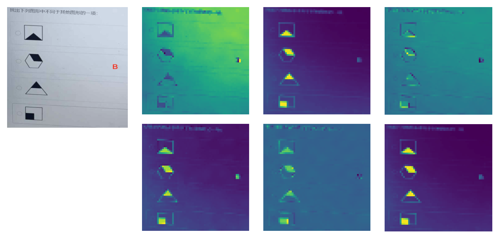
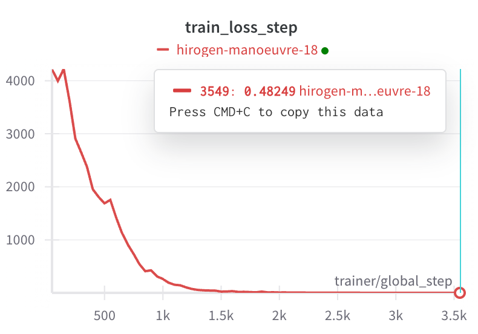

# Figure Reasoning Problem Search

## DINO train

### Try
- vit-small
- 17064 images 
- 100 epoch
- 64 batch / 3090Ti GPU

---

- vit-small
- 17064 images 
- 10 epoch
- 64 batch / 3090Ti GPU
- add transform
- local image set crop size: 128 (too many background areas)

